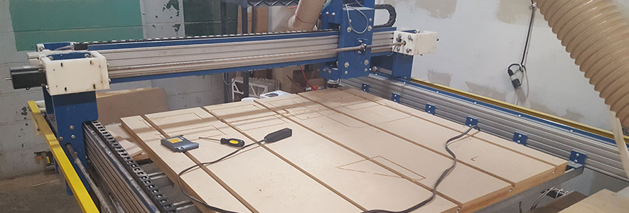

This repository centralizes the documentation and status of the on-going restoration of the custom-built 4x4' CNC router, affectionately named "Chico", found at the [TC Maker hackerspace](http://www.tcmaker.org/) in Minneapolis, MN.

Currently we meet up at the TC Maker space to work on the machine **each Sunday from about 12pm to about 5pm**. Changes to these plans can sometimes be found on the [TC Maker Google Group](https://groups.google.com/forum/#!forum/tcmaker), though you can also email one of the primary project owners below for more detailed information.

## Useful links
* [Read the wiki](https://github.com/jasonwebb/tc-maker-chico/wiki) for any and all documentation generated during the restoration process, including cabling/wiring schemas, mechanical component data, electronics datasheets, operational procedures, and more.
* [Visit the projects page](https://github.com/jasonwebb/tc-maker-chico/projects) to see all of the active, upcoming, and completed tasks identified so far, broken down by sub-system.
* [Visit the issues page](https://github.com/jasonwebb/tc-maker-chico/issues) to see the tasks that are currently being worked on, with detailed notes about what has already been done for each task. _Note that these tasks are derived from the tasks marked as "In progress" in the [projects](https://github.com/jasonwebb/tc-maker-chico/projects) section._

## Getting involved
If you are interested in helping with **documentation** or helping to maintain this Github project (task management, wiki page writing, etc), shoot me a message so I can add you as a collaborator.

If you'd like to show up and help out **in person**, we usually meet on Sundays from about noon to 5pm-ish at the CNC machine in the TC Maker space, though be sure to check the Google Group and FB page below for last-minute changes.

If you are someone who likes to **cover all their bases** and be as up-to-date as possible, the official channels of communication for TC Maker are:

* The [TC Maker Google Group](https://groups.google.com/forum/#!forum/tcmaker) tends to be the place where some CNC router updates get posted, as well as cancellations to upcoming work plans.
* The [TC Maker Facebook page](https://www.facebook.com/groups/85060647690/) _might_ have some information too once in a while.

Also feel free to reach out to the primary project owners with any additional questions:

* **Pete McKenna** _(primary CNC guru)_ - <pete.mckenna@gmail.com>
* **Jason Webb** _(padawan CNC guru and lead documentarian)_ - <zen.webb@gmail.com>
